# Workshop Part 1: 环境和基础设施准备基础部署

## 🎯 学习目标

通过本部分，你将：

- [ ]  理解本方案架构
- [ ]  完成开发环境准备
- [ ]  部署基础设施
- [ ]  配置核心服务

## ⏱ 预计时长：3小时

## 📋 前置条件

- **Azure订阅**
  - 如果没有，可以创建[Azure免费账户](https://azure.microsoft.com/free/)（包含12个月免费服务和$200额度）
  - 所需权限：为了快速完成部署，推荐使用订阅的**Owner**角色，关于最小权限要求请参考：[Azure IoT Operations部署所需权限](https://learn.microsoft.com/azure/iot-operations/deploy-iot-ops/overview-deploy#required-permissions)
- 基本Kubernetes知识

> **💡 补充说明**
> 本文主要采用基于WSL2（Ubuntu）的部署环境。如果你已有Ubuntu环境，可以跳过Step 1中"安装和配置WSL2"和"安装Ubuntu"的步骤。
> 关于具体支持的环境，请参考：[Azure IoT Operations支持的环境](https://learn.microsoft.com/azure/iot-operations/deploy-iot-ops/overview-deploy#supported-environments)

## 🚀 步骤

### Step 1: 环境准备 (30分钟)

1. 安装和配置WSL2

- 更新WSL2到最新版本
- 检查WSL2版本

```powershell
wsl --update
wsl --version
```

2. 确保DNS Tuning已启用

- 按照WSL2官方推荐，启用DNS Tuning以改善DNS查询性能
- 打开Settings应用，按照以下步骤操作：

> 💡 **步骤说明**：
>
> - 打开Settings → System → WSL Settings
> - 找到DNS Tuning选项并启用
>   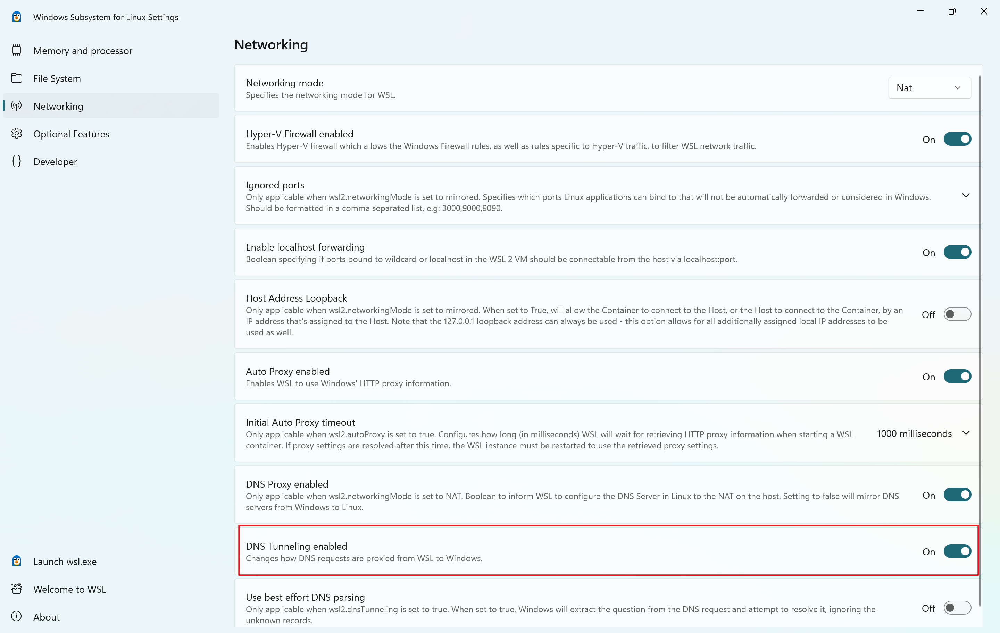

3. 安装Ubuntu

```powershell
wsl --install Ubuntu
```

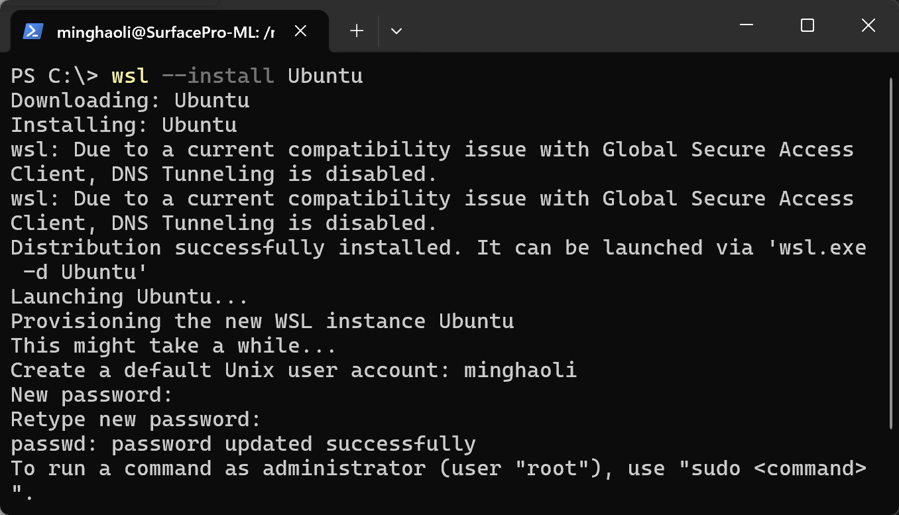

4. 安装必要工具

- 安装Azure CLI
  ```bash
  curl -sL https://aka.ms/InstallAzureCLIDeb | sudo bash
  ```
- 安装connectedk8s扩展
  ```bash
  az extension add --upgrade --name connectedk8s
  ```
- kubectl（K3s自动安装）
- Helm
  ```bash
  sudo apt-get install curl gpg apt-transport-https --yes
  curl -fsSL https://packages.buildkite.com/helm-linux/helm-debian/gpgkey | gpg --dearmor | sudo tee /usr/share/keyrings/helm.gpg > /dev/null
  echo "deb [signed-by=/usr/share/keyrings/helm.gpg] https://packages.buildkite.com/helm-linux/helm-debian/any/ any main" | sudo tee /etc/apt/sources.list.d/helm-stable-debian.list
  sudo apt-get update
  sudo apt-get install helm
  ```

### Step 2: 创建和配置Kubernetes集群 (30分钟)

1. 创建K3s集群

```bash
curl -sfL https://get.k3s.io | sh -
```

2. 配置kubectl访问

```bash
mkdir ~/.kube
sudo KUBECONFIG=~/.kube/config:/etc/rancher/k3s/k3s.yaml kubectl config view --flatten > ~/.kube/merged
mv ~/.kube/merged ~/.kube/config
chmod 0600 ~/.kube/config
export KUBECONFIG=~/.kube/config
kubectl config use-context default
sudo chmod 644 /etc/rancher/k3s/k3s.yaml
```

3. 验证kubectl安装

```bash
kubectl version --client
```

4. 优化系统参数

- 增加用户监听限制
  ```bash
  echo fs.inotify.max_user_instances=8192 | sudo tee -a /etc/sysctl.conf
  echo fs.inotify.max_user_watches=524288 | sudo tee -a /etc/sysctl.conf
  sudo sysctl -p
  ```
- 增加文件描述符限制
  ```bash
  echo fs.file-max = 100000 | sudo tee -a /etc/sysctl.conf
  sudo sysctl -p
  ```

5. 检查集群状态

```bash
kubectl get pods --all-namespaces
```

预期：kube-system命名空间Pod为Running或Completed。
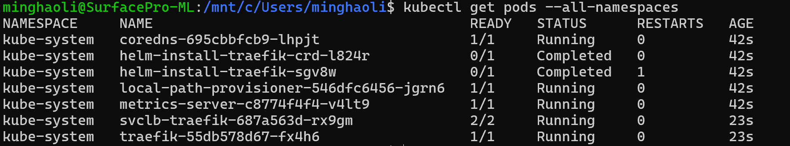

6. 创建项目目录，克隆Github Repository并在VS Code中打开

```bash
cd ~
mkdir projects
git clone https://github.com/Liminghao0922/azure-iot-operations-edge-cloud-pattern
cd azure-iot-operations-edge-cloud-pattern/
code .
```

- VS  Code Python扩展：[Python - Visual Studio Marketplace](https://marketplace.visualstudio.com/items?itemName=ms-python.python)
- VS Code Kubernetes扩展：[Kubernetes - Visual Studio Marketplace](https://marketplace.visualstudio.com/items?itemName=ms-kubernetes-tools.vscode-kubernetes-tools) （可选但推荐）

安装该插件后，VS Code左侧会出现Kubernetes图标，点击后可以看到当前集群状态和资源。
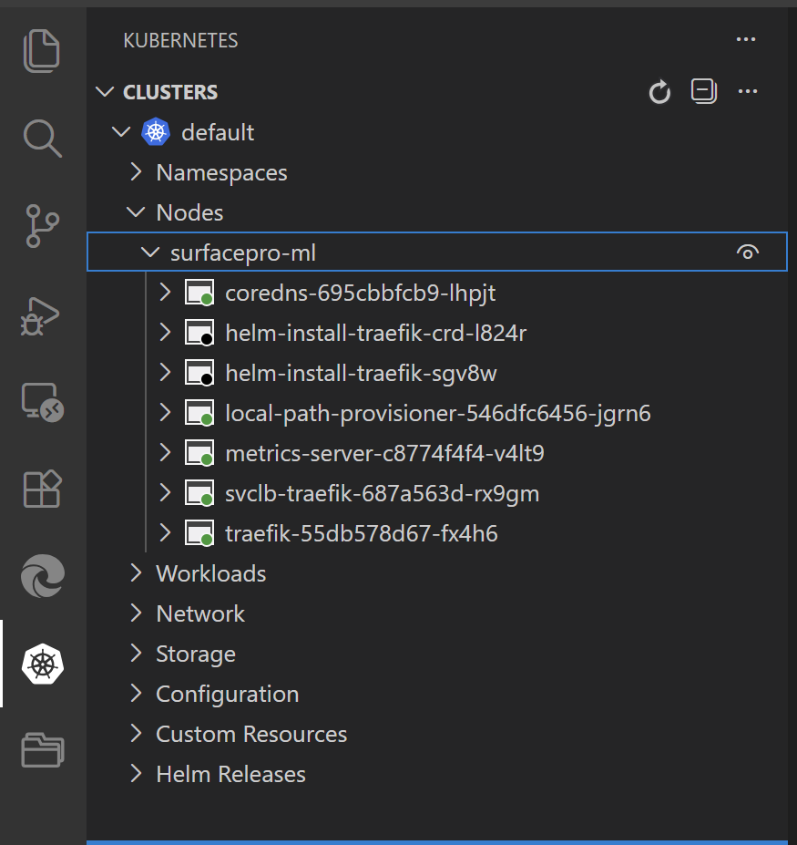

### Step 3: Azure Arc启用 (30分钟)

1. 登录Azure

   ```
   az login
   ```
2. 注册Azure资源提供程序（只需一次）

```bash
az provider register -n "Microsoft.ExtendedLocation"
az provider register -n "Microsoft.Kubernetes"
az provider register -n "Microsoft.KubernetesConfiguration"
az provider register -n "Microsoft.IoTOperations"
az provider register -n "Microsoft.DeviceRegistry"
az provider register -n "Microsoft.SecretSyncController"
```

3. 创建资源组

```bash
az group create --location japaneast --name rg-demo-aio
```

验证：应看到资源组创建的JSON响应。

4. Arc启用集群

```bash
az connectedk8s connect \
  --name aiocluster \
  -l eastus \
  --resource-group rg-demo-aio\
  --enable-oidc-issuer \
  --enable-workload-identity \
  --disable-auto-upgrade
```

预期：命令成功完成（需几分钟）。

5. 验证Arc代理

```bash
kubectl get deployments,pods -n azure-arc
```

所有Pod应为Running
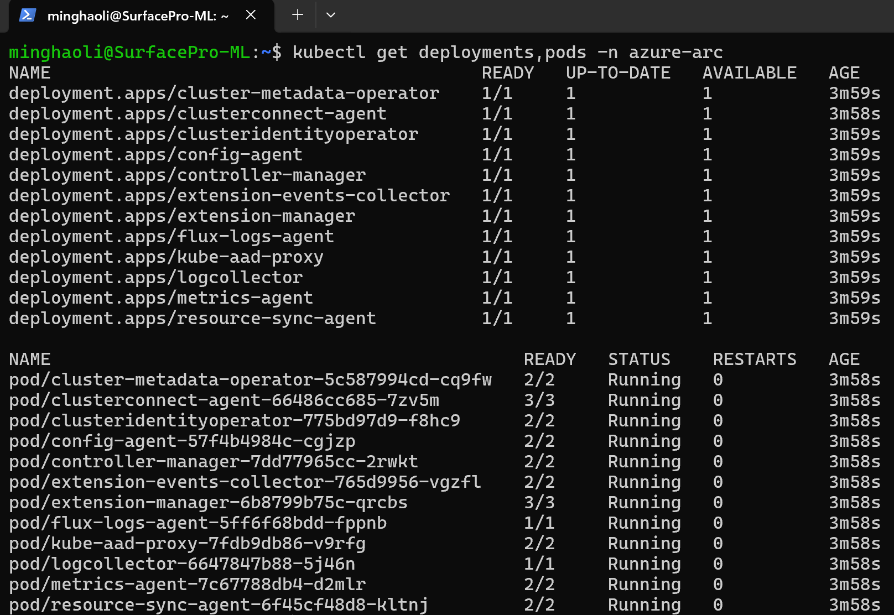

6. 获取OIDC Issuer URL

```bash
az connectedk8s show \
  --resource-group rg-demo-aio\
  --name aiocluster \
  --query oidcIssuerProfile.issuerUrl \
  --output tsv
```

保存此URL，后续步骤需要。

7. 配置K3s API服务器

```bash
sudo nano /etc/rancher/k3s/config.yaml
```

添加如下内容（替换<SERVICE_ACCOUNT_ISSUER>为上一步URL）

```
kube-apiserver-arg:
  - service-account-issuer=<SERVICE_ACCOUNT_ISSUER>
  - service-account-max-token-expiration=24h
```

保存并退出<Ctrl+X, Y, Enter>

8. 启用自定义位置功能

```bash
export OBJECT_ID=$(az ad sp show --id bc313c14-388c-4e7d-a58e-70017303ee3b --query id -o tsv)
az connectedk8s enable-features \
  -n aiocluster \
  -g rg-demo-aio \
  --custom-locations-oid $OBJECT_ID \
  --features cluster-connect custom-locations
```

重启K3s

```bash
sudo systemctl restart k3s
```

等待1-2分钟

### Step 4: 通过Azure门户部署Azure IoT Operations (30分钟)

1. 在Azure门户创建IoT Operations实例

- 访问 [Azure Portal](https://portal.azure.com/)
- 搜索并选择 Azure IoT Operations
- 点击 Create

2. 基础配置（Basics标签）


   | 参数                     | 值           |
   | ------------------------ | ------------ |
   | Subscription             | 选择你的订阅 |
   | Resource group           | rg-demo-aio  |
   | Cluster name             | aiocluster   |
   | Custom location name     | 默认或自定义 |
   | Deployment version       | 1.2 (latest) |
   | 点击 Next: Configuration |              |

   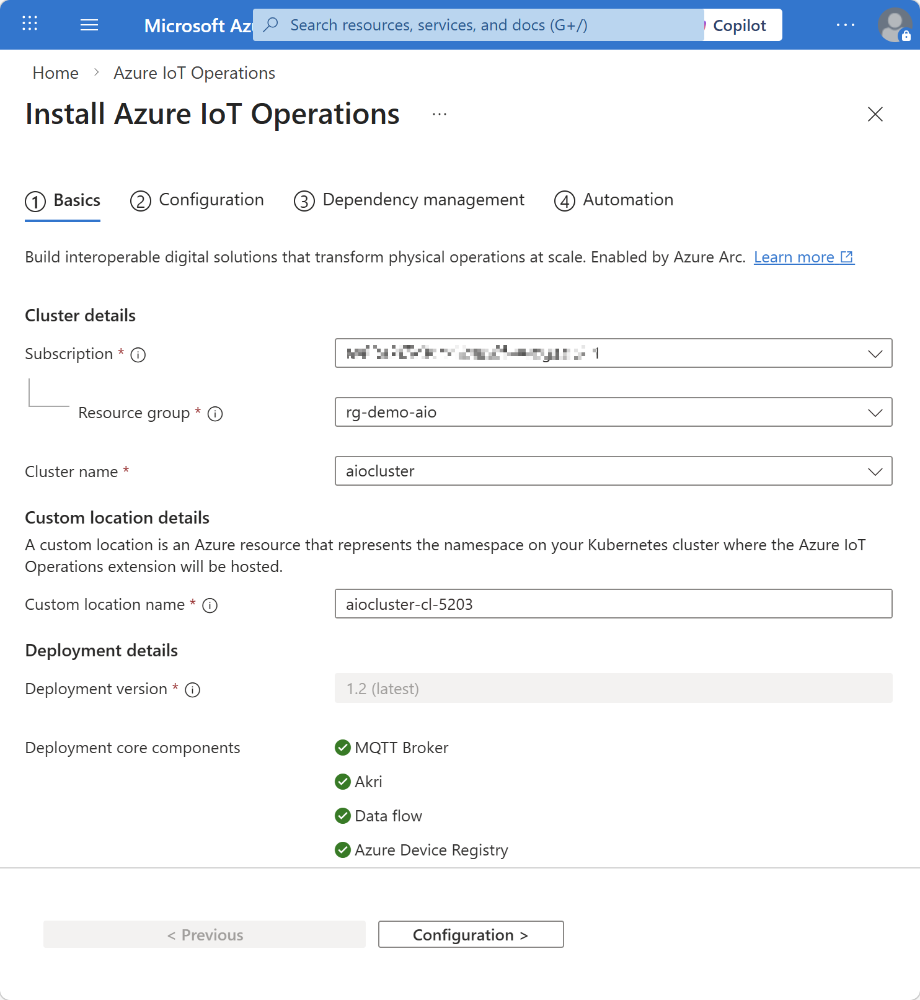
3. 配置设置（Configuration标签）


   | 参数                             | 说明         |
   | -------------------------------- | ------------ |
   | Azure IoT Operations name        | 默认或自定义 |
   | MQTT broker configuration        | 默认（测试） |
   | Data flow profile configuration  | 默认（测试） |
   | 点击 Next: Dependency management |              |

   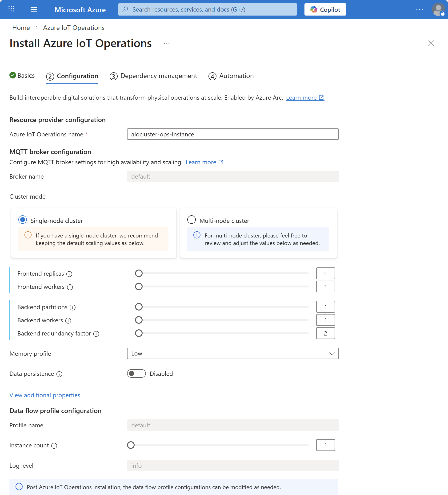
4. 依赖管理 - Schema Registry

- 选择 Create new
- 填写名称、命名空间
- 选择或创建存储账户与容器
  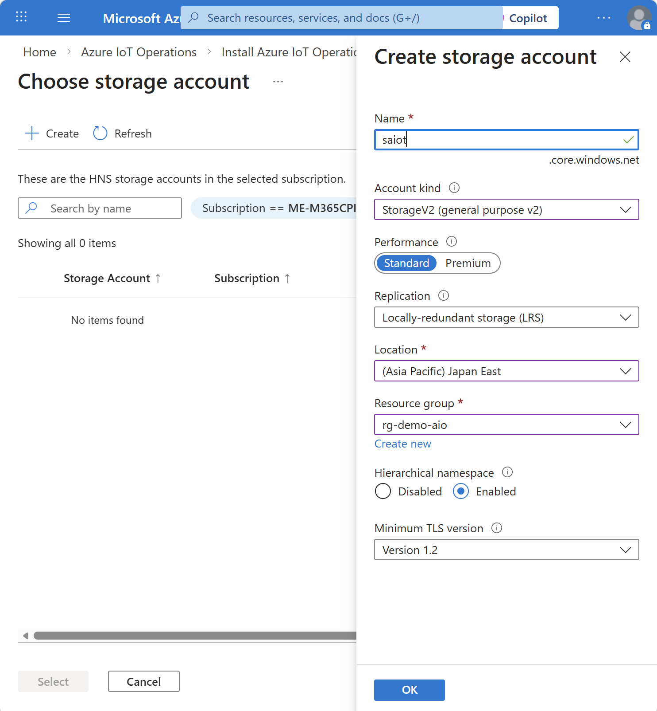
  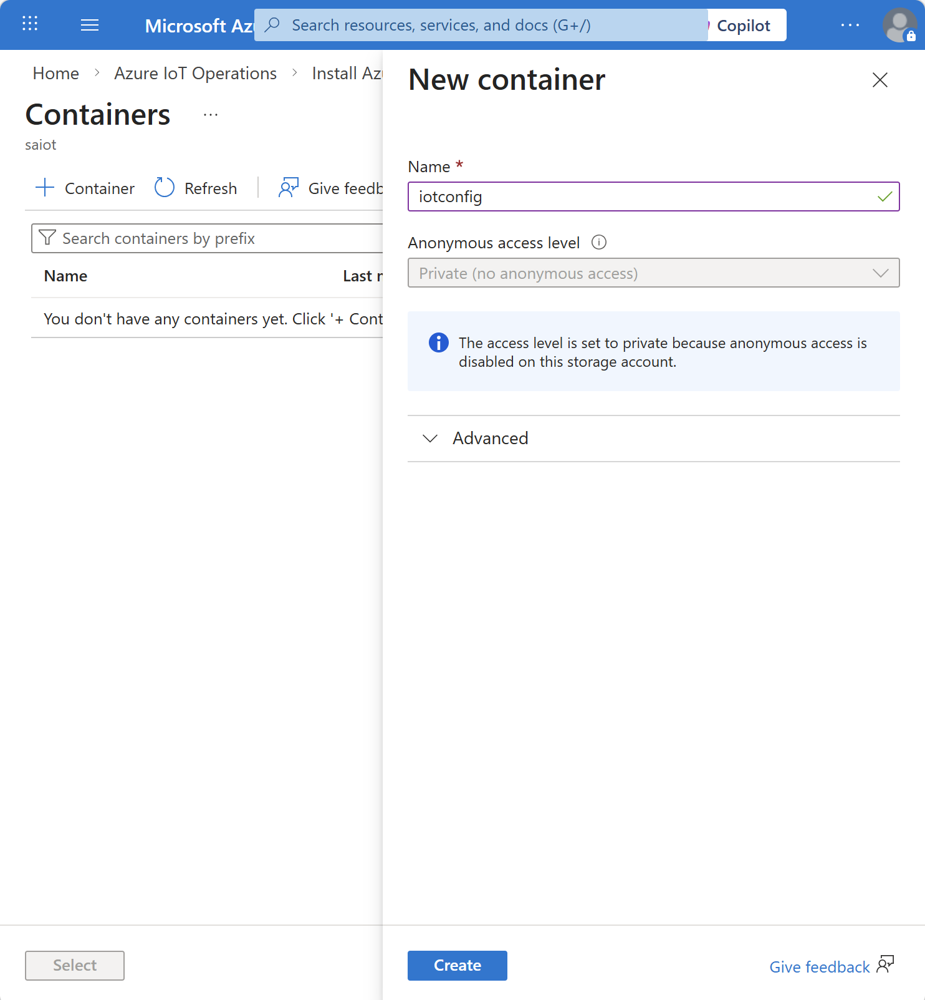
- 点击 Apply
  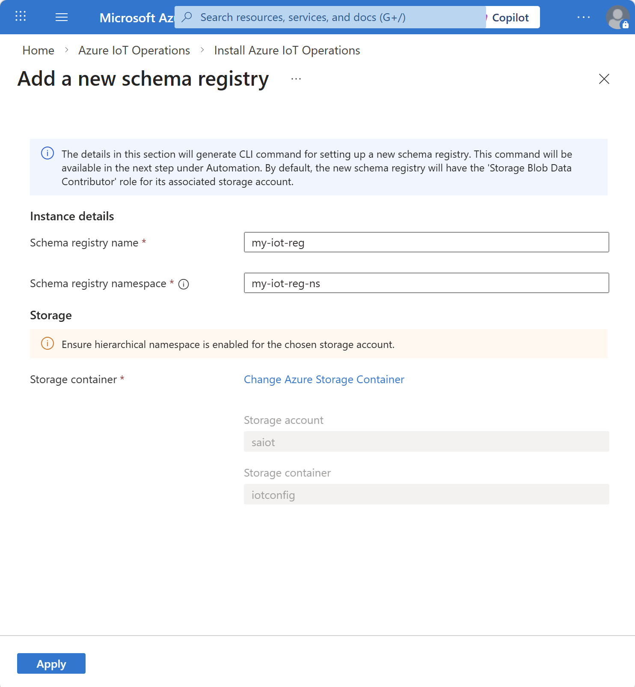

5. 依赖管理 - Device Registry

- 选择 Create new
- 填写基础信息（订阅、资源组、名称、区域）
- 完成创建并选择新命名空间
  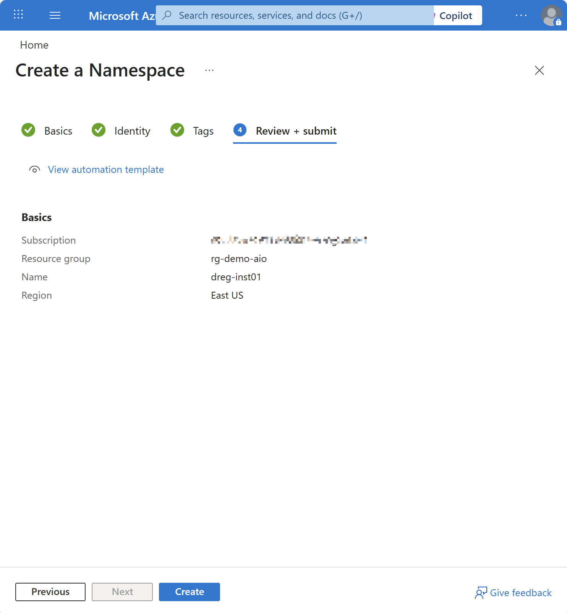

6. 安全设置

- 选择 **Secure settings** 部署选项
- **Key Vault 配置**

  - 选择现有 Key Vault 或创建新的
  - 确保 Key Vault 已启用 RBAC（基于角色的访问控制）并且给作业用户赋予了 `Key Vault Secrets Officer`角色
    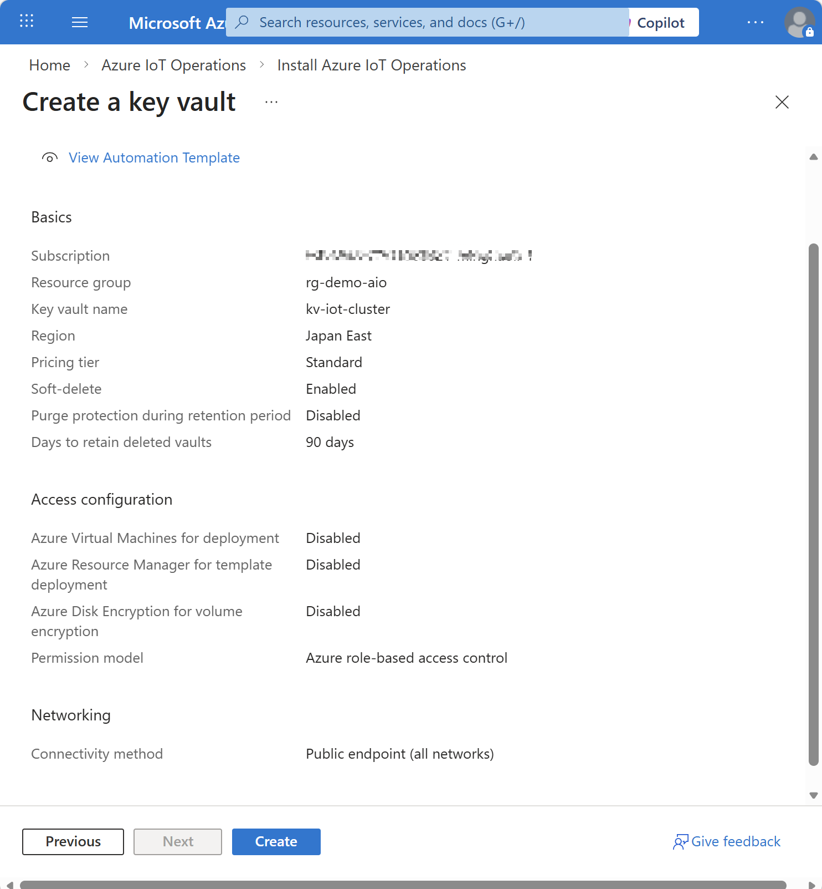
- **Managed Identity 配置**

  - 创建用于同步密钥的托管标识
    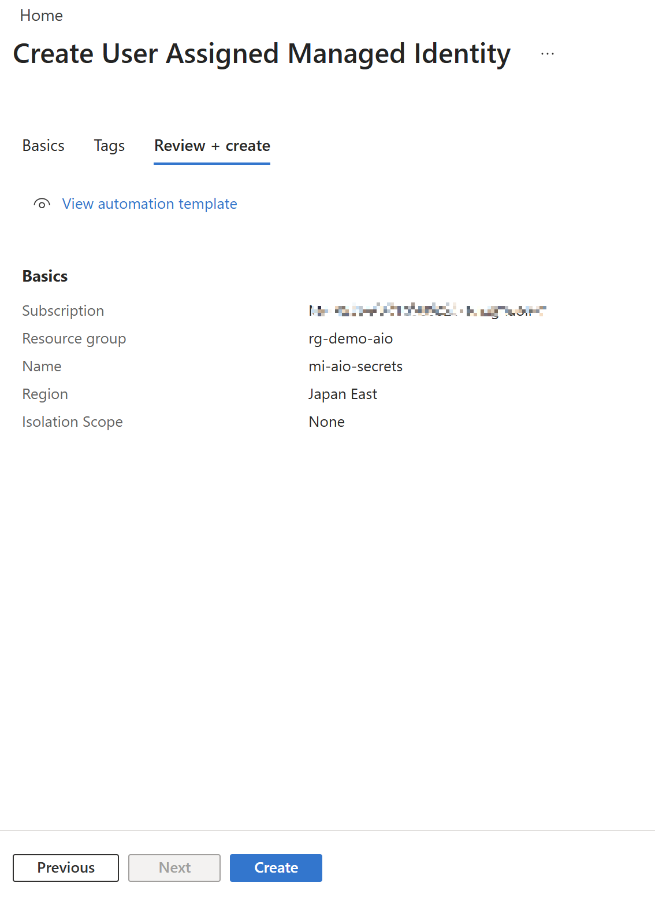
  - 创建用于进行云链接的托管标识
    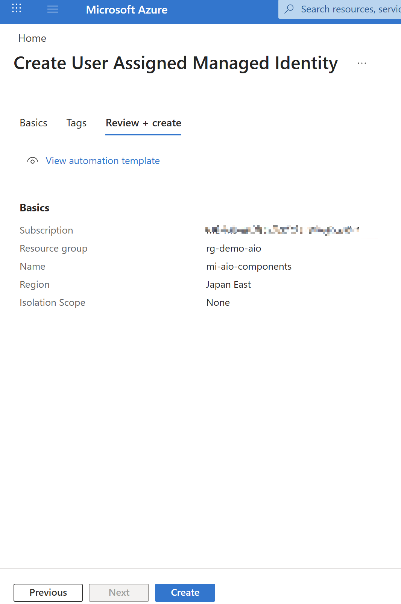
- 点击 **Automation >**
  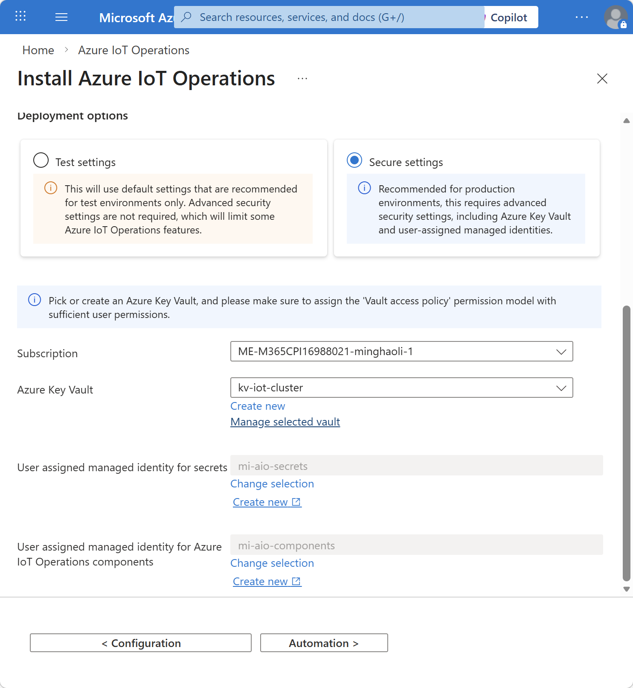

> **💡 提示**：
>
> - 生产环境强烈推荐使用 Secure settings
> - 使用 Managed Identity 避免在代码中硬编码凭据
> - Key Vault 应启用软删除和清除保护
> - 消息信息可以参考[Enable secure settings in Azure IoT Operations | Microsoft Learn](https://learn.microsoft.com/en-us/azure/iot-operations/deploy-iot-ops/howto-enable-secure-settings?tabs=bash)

### Step 5: 运行部署命令 (30-60分钟)

1. 获取并运行门户Automation标签中的Azure CLI命令
   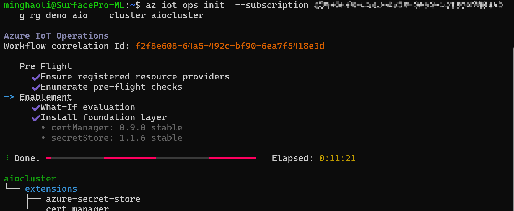
2. 依次运行：

- 交互式登录Azure

  ```bash
  az login
  ```
- 安装Azure IoT Operations CLI扩展

  ```bash
  az extension add --upgrade --name azure-iot-ops
  ```
- 创建schema registry，注意自动生成的脚本不会指定location，我们这里需要明确指定 `--location eastus`。

  ```bash
  az iot ops schema registry create  \
   --subscription <subscription-id>  \
   -g rg-demo-aio  \
   -n my-iot-reg  \
   --registry-namespace my-iot-reg-ns  \
   --sa-resource-id /subscriptions/<subscription-id>/resourceGroups/rg-demo-aio/providers/Microsoft.Storage/storageAccounts/saiot   \
   --sa-container iotconfig  \
   --location eastus
  ```
- 初始化集群（10几分钟）# 复制门户命令 `az iot ops init`
- 部署Azure IoT Operations (30分钟) # 复制门户命令 `az iot ops create`
  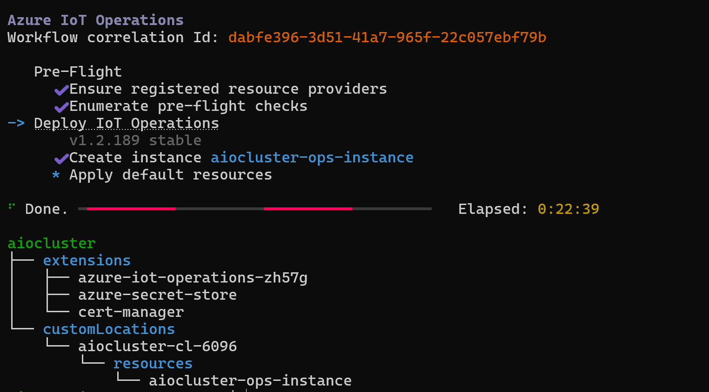
- 启动密钥同步 # 复制门户命令 `az iot ops secretsync enable`
- 注意：长运行命令可在终端查看进度

3. 等待所有命令完成，关闭门户向导

### Step 6: 验证部署 (10分钟)

1. 检查部署健康状况

```bash
az iot ops check
```

预期：
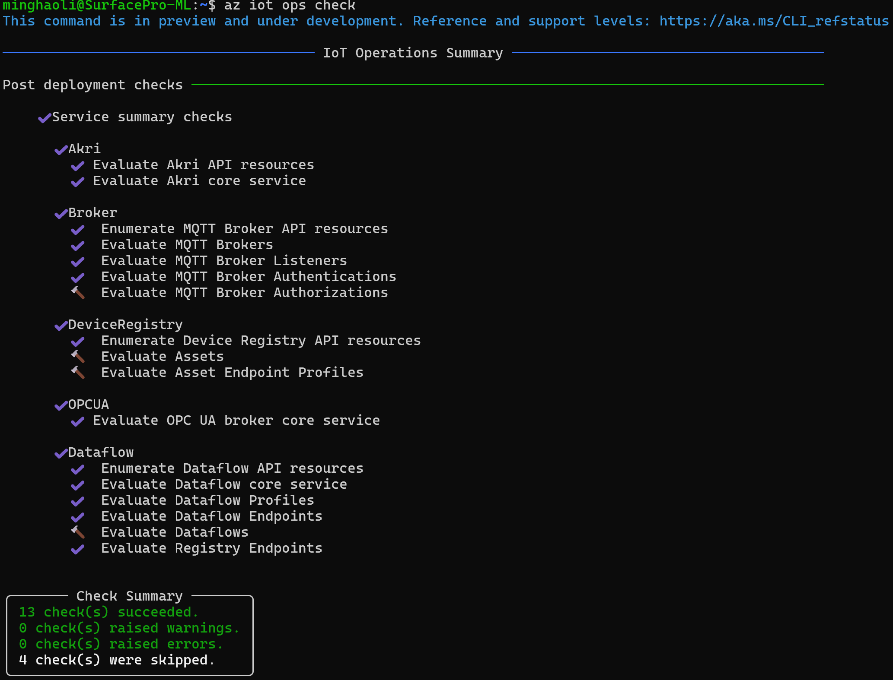
2. 检查broker详细健康检查

```bash
az iot ops check --svc broker --detail-level 1
```

3. 访问Operations UI

- 打开 [IoT Operations UI](https://iotoperations.azure.com/)
- 使用Microsoft Entra ID登录
- 查看未分配实例，确认集群已创建

## ✅ 验证清单

- [ ]  集群已运行
- [ ]  所有Pod为Running状态
- [ ]  服务分配了IP地址
- [ ]  健康端点可访问
- [ ]  日志已收集
- [ ]  指标已收集

## 🔗 相关资源

- [Azure IoT Operations文档](https://learn.microsoft.com/en-us/azure/iot-operations/)
- [Kubernetes安装指南](https://kubernetes.io/docs/)
- [K3s官方文档](https://docs.k3s.io/)
- [Azure Arc文档](https://learn.microsoft.com/en-us/azure/azure-arc/)
- [Azure CLI参考](https://learn.microsoft.com/en-us/cli/azure/)

## 🆘 常见问题

**问题：设备需要被管理才能访问资源**

- 解决：重新运行 `az login` 并确保浏览器交互式登录

**问题：kubectl无法访问集群**

- 解决：确认环境变量设置
  ```bash
  export KUBECONFIG=~/.kube/config
  ```

**问题：Arc连接失败**

- 解决：
  1. 检查Azure账户权限（需Owner或Contributor+User Access Administrator）
  2. 确认资源提供程序已注册
  3. 检查网络连接

**问题：部署命令超时**

- 解决：命令可能需10-15分钟，失败时运行 `az iot ops check` 查看状态

---

## 预计总时间

- 环境准备 (Step 1)：30分钟
- Kubernetes集群创建 (Step 2)：30分钟
- Azure Arc启用 (Step 3)：30分钟
- 门户部署 (Step 4)：30分钟
- 运行部署命令 (Step 5)：30-60分钟
- 验证 (Step 6)：10分钟

**总计：约3小时**

---

## 🎉 Part 1 完成！下一步

恭喜！已完成Part 1全部步骤。请继续 [Part 2: MQTT和数据流配置](./part2-zh.md)

---

**最后更新**：2026年3月4日
