# Azure IoT Operations - Hands-On 下半分 (Part 2)

本パートは Part 1 の続きとして、MQTT Broker の設定、Data Flow の構築、エンドツーエンドのテストを扱います。

**前提条件**: [Part 1](./part1-ja.md) を完了していること

## Step 1: MQTT Broker の構成 (30分)

### Step 1.1: MQTT Broker のアーキテクチャ

Azure IoT Operations MQTT Broker は複数のリスナーをサポートします。

- **Default endpoint**: クラスタ内通信
- **External endpoint**: クラスタ外クライアント向け

### Step 1.2: フロントエンドサービスの確認

```bash
# MQTT Broker のサービス一覧
kubectl get svc -n azure-iot-operations
```

### Step 1.3: Azure ポータルで外部接続用 BrokerListener を作成

外部接続向けに BrokerListener を作成します。

1. Azure ポータルで IoT Operations インスタンスを開く
2. **Components** の **MQTT Broker** を選択
3. **MQTT broker listener for LoadBalancer** > **Create**

   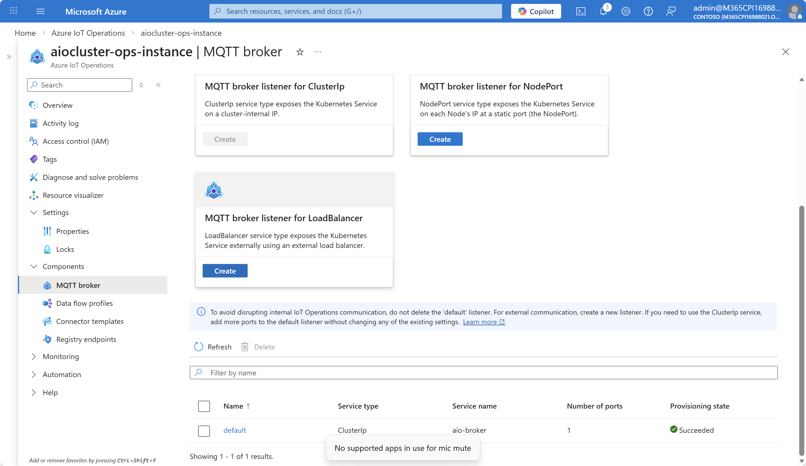
4. 基本設定:

   - **Name**: 例 `loadbalancer-listener`
   - **Service name**: 空欄（リスナー名が使われる）
   - **Service type**: **LoadBalancer**
5. **Ports** でテスト用ポートを設定:

   - **Port**: **1883**
   - **Authentication**: **None**
   - **Authorization**: **None**
   - **Protocol**: **MQTT**
   - **TLS**: なし

   > **重要**: テスト用構成です。本番では TLS と認証を必ず有効化してください。
   >
6. **Add port entry** で本番用ポートを追加:

   - **Port**: **8883**
   - **Authentication**: **default**
   - **Authorization**: **None**
   - **Protocol**: **MQTT**
   - **TLS**: **Add**
7. **TLS configuration** を設定:

   **必須**:

   - **TLS mode**: **Automatic**（cert-manager 管理）
   - **Issuer name**: `azure-iot-operations-aio-certificate-issuer`
   - **Issuer kind**: **ClusterIssuer**

   **任意**（テストでは既定のまま）:

   - **Issuer group**: `cert-manager.io`
   - **Private key algorithm**: `Ec256`
   - **Private key rotation policy**: `Always`
   - **DNS names**: 追加の SAN
   - **IP addresses**: 追加の SAN
   - **Duration**: 既定 90 日
   - **Renew before**: 既定

   既定のまま **Apply** をクリック。

   > **補足**: Automatic は組み込み発行者を使用。本番ではカスタム発行者推奨。
   >
8. **Create listener** をクリック

### Step 1.4: MQTT Broker のエンドポイント取得

LoadBalancer リスナー作成後、外部 IP を確認します。

```bash
kubectl get svc -n azure-iot-operations
```

リスナーのサービスを探し、`<external-ip>:1883`（テスト）または `<external-ip>:8883`（TLS）を控えます。

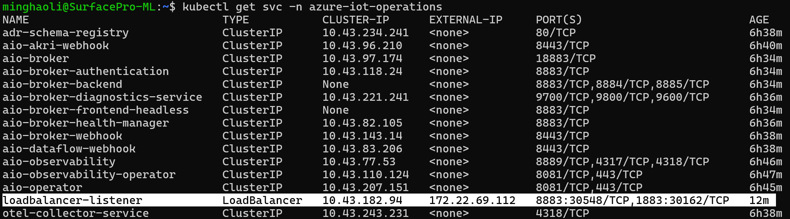
----------------------------------------------------------------

## Step 2: Microsoft Fabric Real-Time Intelligence データソース作成 (25分)

### Step 2.1: Event Stream の作成

1. [https://fabric.microsoft.com](https://fabric.microsoft.com) にサインイン
2. Workspace を作成または選択
3. **New Item** → **Eventstream** を選択
   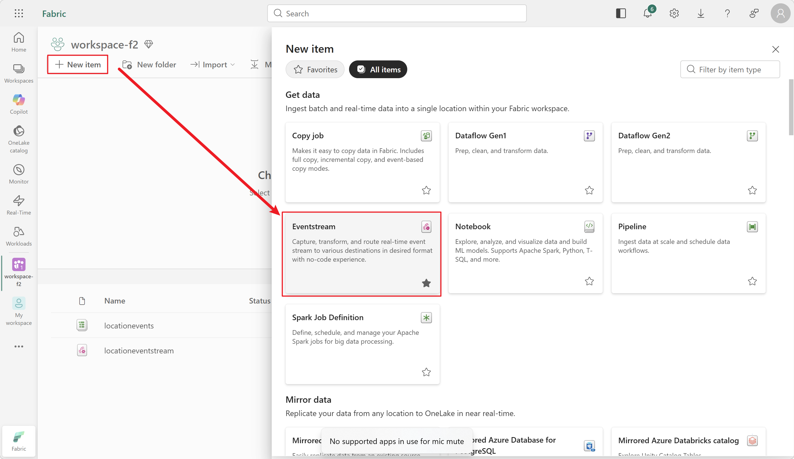
4. 例 `aio-eventstream` で作成
   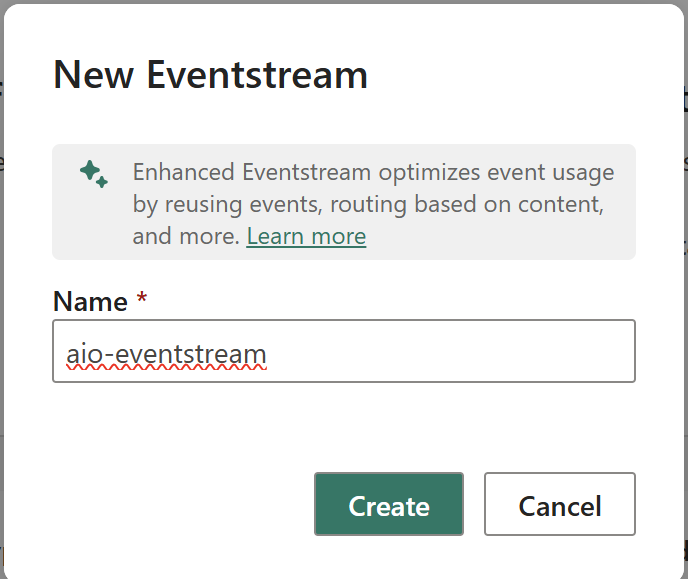
5. 編集画面を開く

### Step 2.2: Custom endpoint の追加

1. Eventstream で **Add source** → **Custom endpoint**
   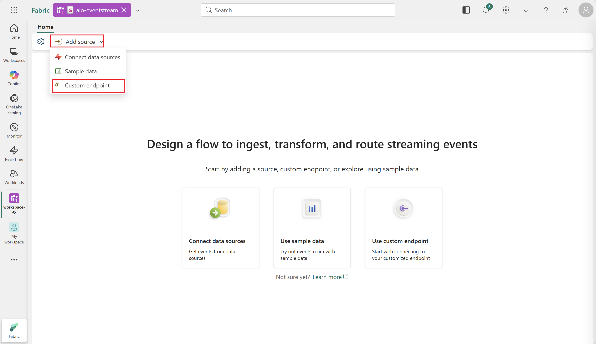
2. 設定:
   - ソース名を入力（例 `mqtt-iot-source`）
     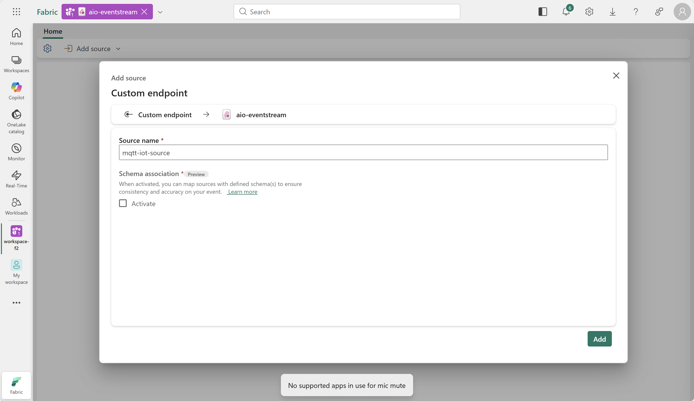
   - Publish をクリック
     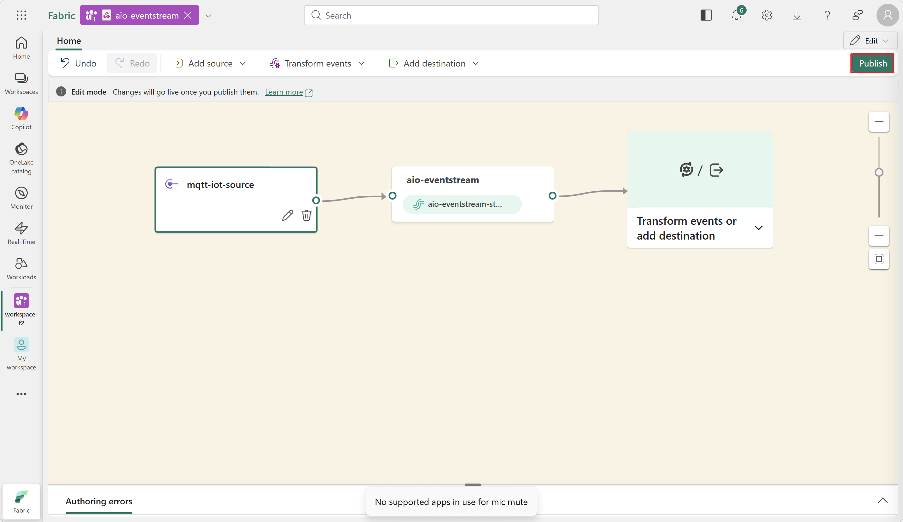

**参考**: [Add a Custom Endpoint or Custom App Source to an Eventstream - Microsoft Fabric](https://learn.microsoft.com/en-us/fabric/real-time-intelligence/event-streams/add-source-custom-app?pivots=basic-features#add-custom-endpoint-data-as-a-source)

### Step 2.3: Kafka 互換エンドポイント情報の取得

Details ペインで以下を確認:

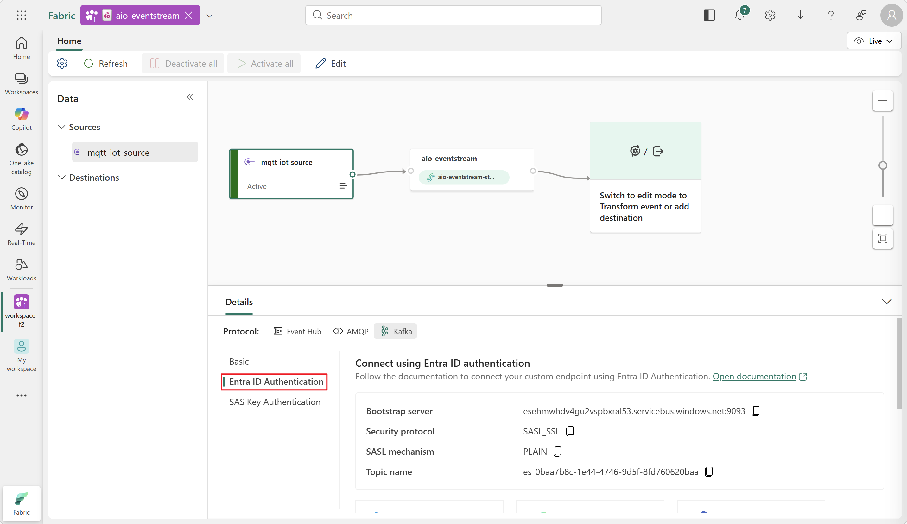

- Event Hub 互換エンドポイント
- 共有アクセスキー
- Event Stream 名

---

## Step 3: Data Flow 1 - MQTT クライアントから Fabric (25分)

### Step 3.1: アーキテクチャ - Flow 1

```
┌──────────────┐     ┌──────────────┐     ┌────────────┐
│  MQTT Client │────→│  MQTT Broker │────→│ Fabric RTI │
│   (MQTTX)    │     │   Default    │     │ Eventstream│
│              │     │   Endpoint   │     │            │
└──────────────┘     └──────────────┘     └────────────┘
                         (No Transform)
```

### Step 3.2: Data Flow Endpoint 作成 - Fabric RTI

1. Data Flow 用 Managed Identity を作成

   ```bash
   az identity create \
   --name mi-dataflow-fabric \
   --resource-group rg-demo-aio \
   --location japaneast
   ```
2. Client ID と Tenant ID を取得

   ```bash
   DATAFLOW_MI_CLIENT_ID=$(az identity show \
   --name mi-dataflow-fabric \
   --resource-group rg-demo-aio \
   --query clientId -o tsv)

   TENANT_ID=$(az account show --query tenantId -o tsv)

   echo "Client ID: $DATAFLOW_MI_CLIENT_ID"
   echo "Tenant ID: $TENANT_ID"
   ```
3. Federated Identity を設定

   ```bash
   # OIDC Issuer 取得
   OIDC_ISSUER=$(az connectedk8s show \
   --resource-group rg-demo-aio \
   --name aiocluster \
   --query oidcIssuerProfile.issuerUrl \
   --output tsv)

   # Data Flow Service Account 用の federated credential
   az identity federated-credential create \
   --name "dataflow-fabric-federation" \
   --identity-name mi-dataflow-fabric \
   --resource-group rg-demo-aio \
   --issuer $OIDC_ISSUER \
   --subject system:serviceaccount:azure-iot-operations:aio-dataflow-default \
   --audience api://AzureADTokenExchange
   ```
4. Managed Identity に Fabric へのアクセス権を付与
   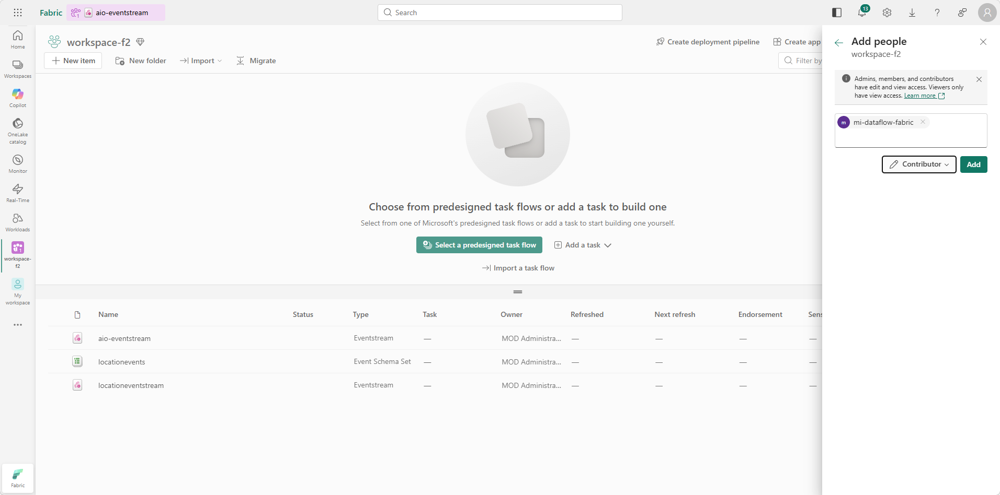
5. [IoT Operations experience](https://iotoperations.azure.com/) にサインイン
6. インスタンスを選択
7. **Data flow endpoints** に移動
8. **Microsoft Fabric Real-Time Intelligence** を新規作成
   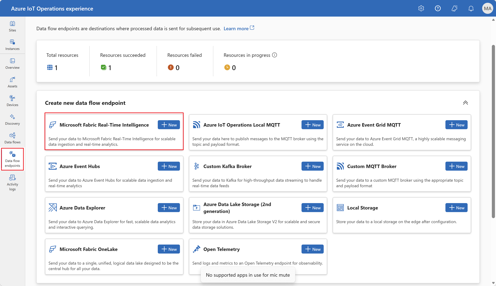
9. 設定:

- **Name**: `fabric-rti-endpoint`
- **Authentication method**: **User assigned managed identity**
- **Host**: Fabric の **Bootstrap server**
  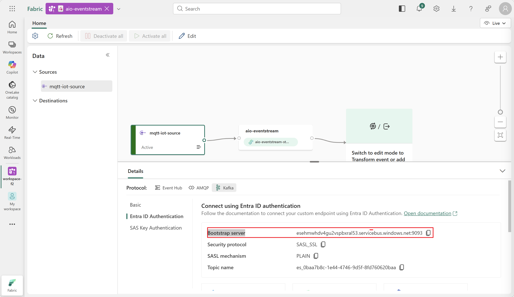
- **Client ID**: 上記の値
- **Tenant ID**: 上記の値

10. **Apply** をクリック
    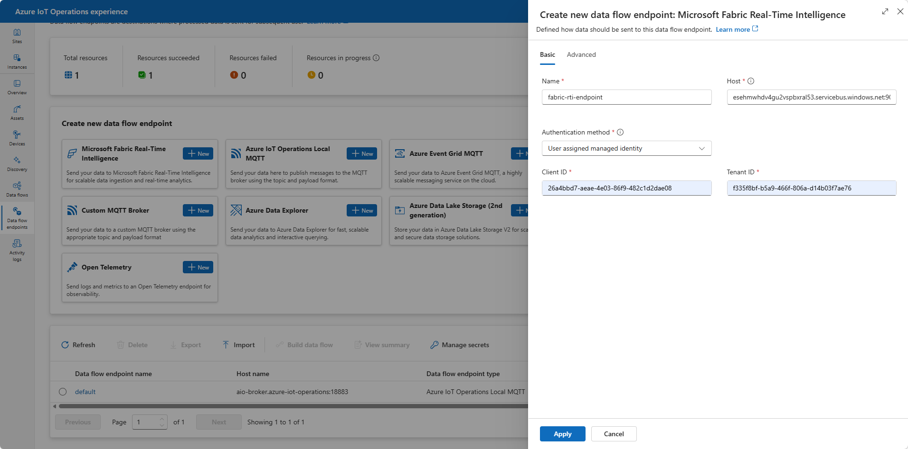

### Step 3.3: Data Flow 作成 - MQTT から Fabric

1. Data Flows で **Create new**
   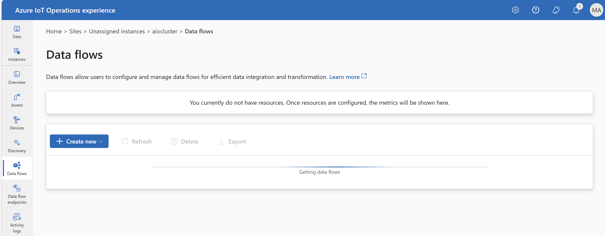
2. 設定:

   - **Source**: **Data flow endpoint** → **Default Endpoint**
   - **Topic**: 例 `sensors/temperature` または `#`
   - **Message Schema**: **Add** をクリック（必須）

     > **重要**: Message Schema がないと Fabric に `{}` が表示されます。
     >

     Message Schema 手順:

     1. Message Schema の **Add** をクリック
     2. 既存 Schema を選択、または **Create new**
     3. Schema 生成ツール:
        - [Schema Generator Helper](https://azure-samples.github.io/explore-iot-operations/schema-gen-helper/)
        - サンプル JSON を入力して Schema を生成
     4. Schema を Azure IoT Operations Schema Registry に保存
     5. Data Flow で Schema を選択

     参考: [Set Kafka Message Schema](https://learn.microsoft.com/en-us/azure/iot-operations/connect-to-cloud/howto-configure-kafka-endpoint?tabs=portal#set-kafka-message-schema)
   - **Transform**: None
   - **Destination**: **fabric-rti-endpoint** を選択し、Topic を Fabric からコピー
     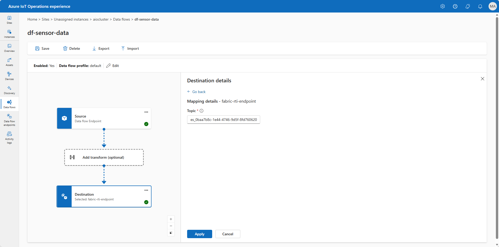
3. **Save** をクリックし、設定入力後に再度 **Save**

   - **Data flow name**: 例 **df-sensor-data**
   - **Enable data flow**: **Yes**
   - **Request data persistence**: **Yes**
   - **Data flow profile**: **default**
     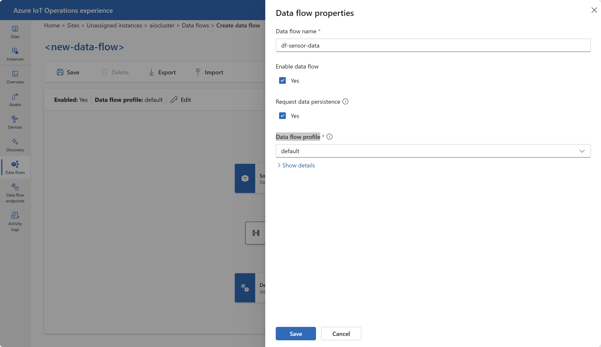

### Step 3.4: Data Flow の確認

```bash
# Data Flow 状態
kubectl get dataflows -n azure-iot-operations

# 詳細
kubectl describe dataflow -n azure-iot-operations
```

---

## Step 4: MQTTX テスト - Flow 1 (25分)

### Step 4.1: MQTTX のインストール

1. [MQTTX - Open source MQTT Client](https://mqttx.app/) をダウンロード
2. インストール

### Step 4.2: MQTTX 接続設定

1. MQTTX を起動
2. 新規接続を作成:

   - **Name**: `AIO-Cluster`
   - **Host**: MQTT Broker の IP/ホスト名
   - **Port**: `1883`
   - **Protocol**: `mqtt://`
   - **Client ID**: `mqttx-client-test`
   - **Username**: 必要なら
   - **Password**: 必要なら
3. **Connect** をクリック

### Step 4.3: テストメッセージを送信

1. MQTTX の **Publish** タブを開く
2. 設定:

   - **Topic**: `sensors/temperature`
   - **Payload**:

   ```json
   {
     "timestamp": "2026-02-26T10:30:00Z",
     "temperature": 22.5,
     "unit": "celsius",
     "sensorId": "sensor-001"
   }
   ```

   - **QoS**: 1
3. **Publish** をクリック
4. 数秒間隔で複数回送信

### Step 4.4: Fabric でデータ確認

1. Fabric Real-Time Intelligence に戻る
2. Eventstream で確認:

   - **Data preview** またはメッセージログ
   - JSON を確認
3. データが見えれば Flow 1 成功

**期待結果**: MQTTX からのデータが Fabric に表示される。

**トラブルシュート - `{}` が表示される場合**:

- **原因**: Data Flow Source に Message Schema が未設定
- **対処**:
  1. Data Flow 設定に戻る
  2. Source を編集
  3. **Message Schema** を追加（Step 3.3 を参照）
  4. 保存して再送信
  5. Data preview を更新

> **補足**: Message Schema がないと JSON を正しく解析できず `{}` が表示されます。

---

## Step 5: HTTP Connector で REST API から取得 (30分)

### Step 5.1: HTTP Connector の役割

Azure IoT Operations の HTTP/REST Connector は以下を実行できます。

- WMS などの REST API から在庫データを定期取得
- MQTT メッセージへ変換
- MQTT Broker に送信

カスタムコンテナを作るより簡単で、認証や変換も内蔵されています。

### Step 5.2: モック WMS API を Kubernetes にデプロイ

HTTP Connector がクラスタ内 DNS でアクセスできるよう、Deployment と Service としてデプロイします。

#### 前提: Docker のインストール

WSL で Docker を確認:

```bash
docker --version
```

**未インストールの場合:**

```bash
# パッケージ更新
sudo apt-get update

# 依存関係
sudo apt-get install -y \
  apt-transport-https \
  ca-certificates \
  curl \
  gnupg \
  lsb-release

# Docker GPG key
curl -fsSL https://download.docker.com/linux/ubuntu/gpg | sudo gpg --dearmor -o /usr/share/keyrings/docker-archive-keyring.gpg

# Docker リポジトリ
echo \
  "deb [arch=$(dpkg --print-architecture) signed-by=/usr/share/keyrings/docker-archive-keyring.gpg] https://download.docker.com/linux/ubuntu \
  $(lsb_release -cs) stable" | sudo tee /etc/apt/sources.list.d/docker.list > /dev/null

# Docker Engine
sudo apt-get update
sudo apt-get install -y docker-ce docker-ce-cli containerd.io

# Docker 起動
sudo service docker start

# 確認
 docker --version
```

**任意: sudo なしで実行**

```bash
# docker グループに追加
sudo usermod -aG docker $USER

# 反映（再ログインまたは）
newgrp docker

# 確認
 docker ps
```

#### デプロイ手順:

1. **モック API の Docker イメージ作成**

   ```bash
   cd ~/projects/azure-iot-operations-edge-cloud-pattern
   ```

   ```bash
   docker build -t mock-wms-api:latest -f app/Dockerfile app/

   docker images | grep mock-wms-api
   ```
2. **K3s にイメージを取り込み**

   ```bash
   docker save mock-wms-api:latest -o /tmp/mock-wms-api.tar

   sudo k3s ctr images import /tmp/mock-wms-api.tar

   sudo k3s ctr images ls | grep mock-wms-api

   rm /tmp/mock-wms-api.tar
   ```

   > **補足**: K3s は containerd を使用するため、取り込みが必要です。
   >
3. **Namespace 作成（未作成の場合）**

   ```bash
   kubectl create namespace app

   kubectl get namespace app
   ```
4. **Kubernetes Deployment 作成**

   ```bash
   cat <<EOF | kubectl apply -f -
   apiVersion: apps/v1
   kind: Deployment
   metadata:
     name: mock-wms-api
     namespace: app
   spec:
     replicas: 1
     selector:
       matchLabels:
         app: mock-wms-api
     template:
       metadata:
         labels:
           app: mock-wms-api
       spec:
         containers:
         - name: mock-wms-api
           image: mock-wms-api:latest
           imagePullPolicy: Never
           ports:
           - containerPort: 8080
   EOF

   kubectl get deployment -n app | grep mock-wms-api

   kubectl get pods -n app -w
   ```

   > **重要**: `imagePullPolicy: Never` でローカルイメージを使用します。
   >
5. **Service を公開**

   ```bash
   kubectl expose deployment mock-wms-api \
     --port=8080 \
     --target-port=8080 \
     --type=ClusterIP \
     -n app

   kubectl get svc -n app | grep mock-wms-api

   kubectl describe svc mock-wms-api -n app
   ```
6. **モック API の動作確認**

   ```bash
   kubectl run -it --rm debug --image=curlimages/curl --restart=Never -n azure-iot-operations -- \
     curl http://mock-wms-api.app.svc.cluster.local:8080/api/inventory

   kubectl run -it --rm debug --image=busybox --restart=Never -n azure-iot-operations -- \
     wget -qO- http://mock-wms-api.app.svc.cluster.local:8080/api/inventory
   ```

   期待レスポンス:

   ```json
   [
     {"item_id": "ITEM-001", "name": "Product 1", "quantity": 45, "last_updated": "2026-03-05T10:30:00.123456"},
     {"item_id": "ITEM-002", "name": "Product 2", "quantity": 78, "last_updated": "2026-03-05T10:30:00.123456"},
     {"item_id": "ITEM-003", "name": "Product 3", "quantity": 32, "last_updated": "2026-03-05T10:30:00.123456"}
   ]
   ```

   > **ヒント**: 出力が表示されない場合は少し待って再実行、または `kubectl get pods -n azure-iot-operations -w` で確認。
   >
7. **モック API の情報**

   - **ソース**: `app/src/mock_wms_api.py`
   - **Namespace**: `app`
   - **サービスアドレス**: `0.0.0.0:8080`
   - **API エンドポイント**: `/api/inventory`
   - **Service DNS**:
     - 同一 namespace: `mock-wms-api:8080`
     - 別 namespace: `mock-wms-api.app.svc.cluster.local:8080`
   - **戻り値**: 在庫リスト（item_id, name, quantity, last_updated）

> **補足**: HTTP Connector は `azure-iot-operations` にあるため、フル DNS 名を使用します。

### Step 5.3: HTTP Connector テンプレートをデプロイ

1. Azure ポータルで IoT Operations インスタンスを開く
2. **Connector templates** を選択
3. **Create a connector template** をクリック
   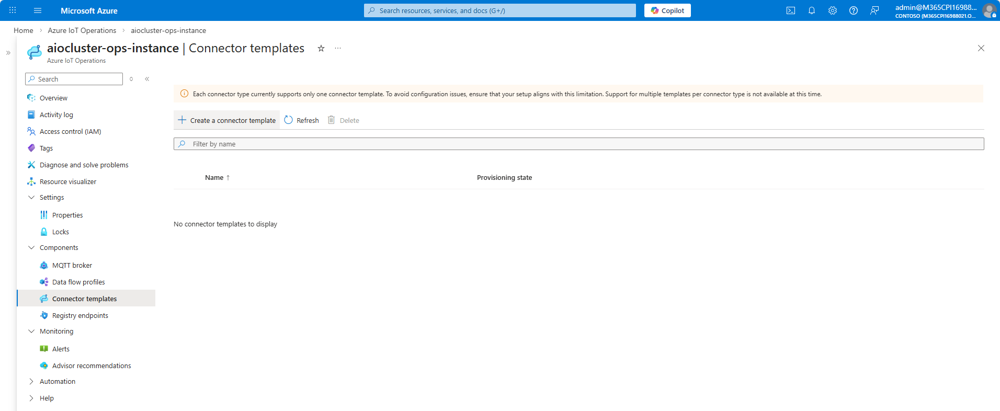
4. 選択:

    - **Connector name**: `Azure IoT Operations connector for REST/HTTP`
       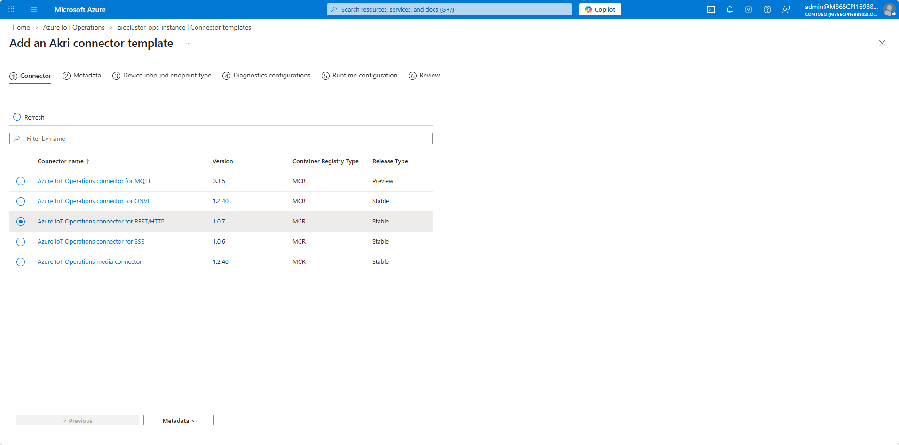
5. 既定のまま進めて **Create**
   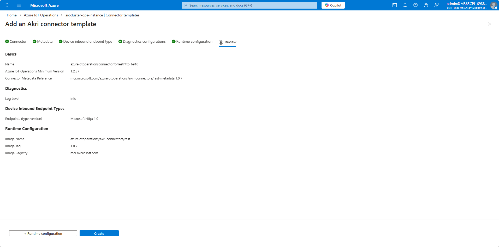

> **補足**: テンプレート作成は一度だけでOK。

### Step 5.4: モック API の状態確認

```bash
kubectl get pods -n app -o wide | grep mock-wms-api

kubectl logs -n app -l app=mock-wms-api -f

kubectl get svc -n app | grep mock-wms-api
```

**期待状態**:

- Pod: `Running` (1/1 Ready)
- Service: ClusterIP

### Step 5.5: Operations Experience でデバイス作成

1. [IoT Operations Experience](https://iotoperations.azure.com/) にサインイン
2. インスタンスを選択
3. **Devices** → **Create device** または **Create new** → **Device**
   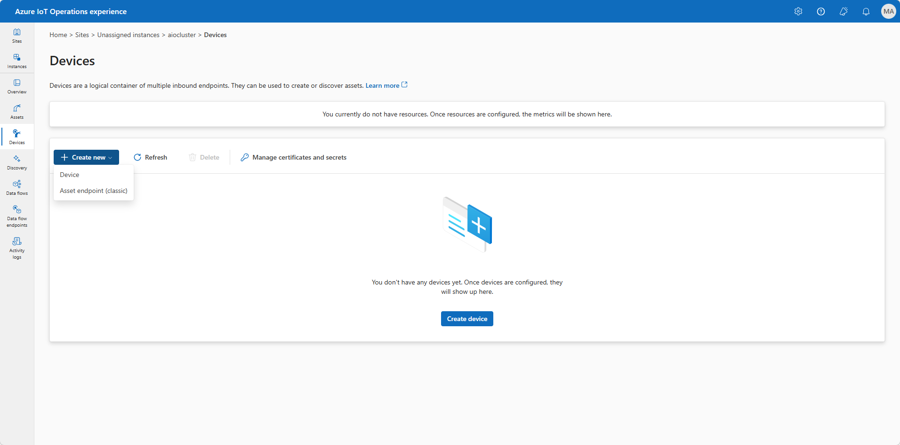
4. デバイス名（例 `wms-api-device`）
5. **Microsoft.Http** で **New** を選択
6. HTTP エンドポイント設定:

   - **Endpoint name**: `wms-endpoint`
   - **Endpoint URL**: `http://mock-wms-api.app.svc.cluster.local:8080`
     - クロス namespace 用のフル DNS を使用
   - **Authentication mode**:
     - `Anonymous`（テスト用）
     - `Username password`（必要時）
     - `X509 certificate`（必要時）
   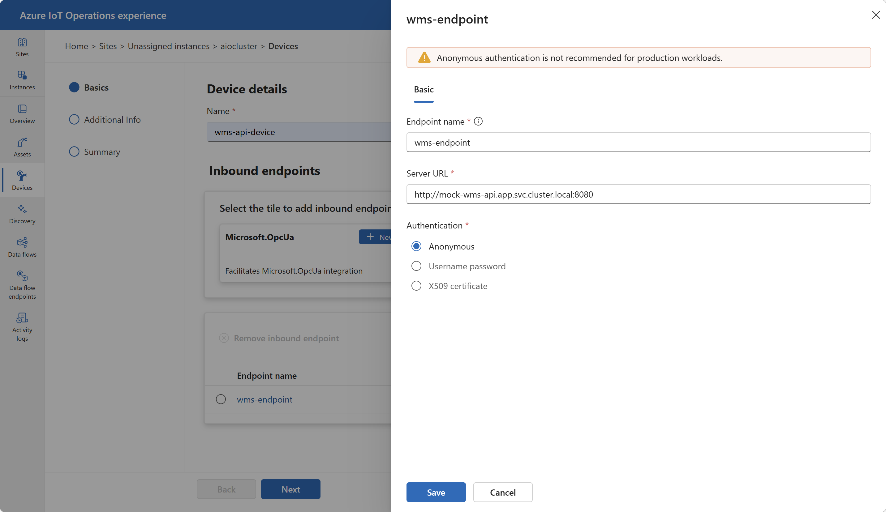
   > **補足**: フル DNS で namespace 間通信を行います。
   >
7. **Save** をクリック
8. **Next** をクリックし必要なら属性追加
9. **Create** をクリック
   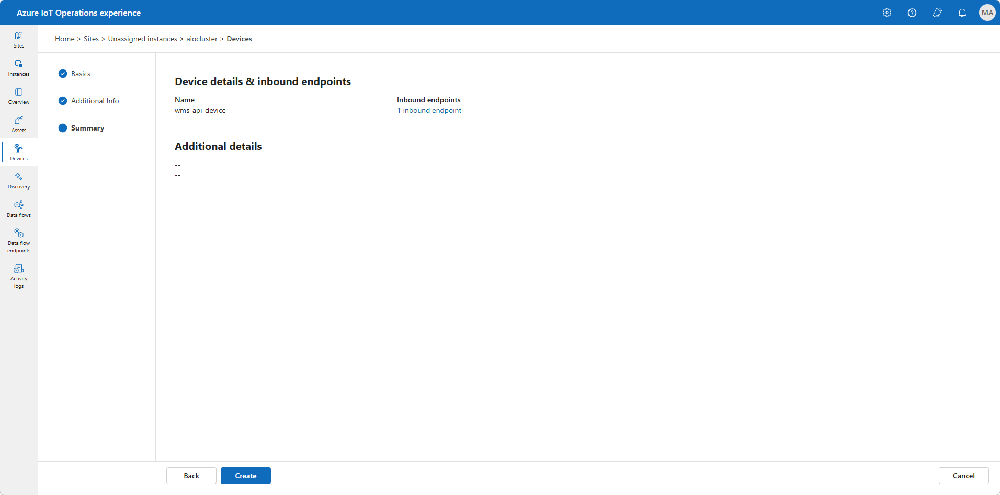

### Step 5.6: Asset と Dataset の作成

1. **Assets** で **Create asset** または **Create new** → **Asset**
   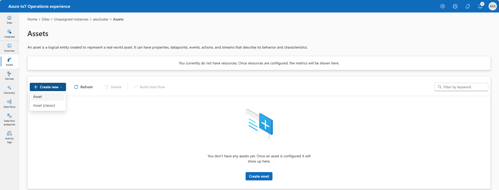
2. HTTP エンドポイント `wms-endpoint` を選択
3. Asset 名（例 `wms`）
   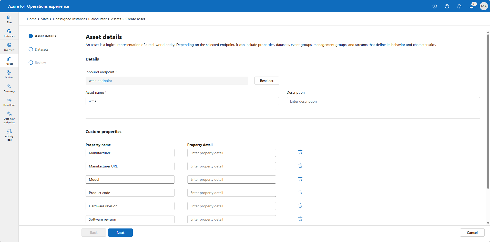
4. **Next**
5. **Create dataset** をクリック:

   - **Dataset name**: `inventory`
   - **Data source**: `/api/inventory`
   - **Sampling interval**: `10000`（10秒、必須）
   - **Destination**: `aio/data/wms/inventory`
   - **Transform**: 空欄

   > **重要**: **Sampling interval** は必須。未設定だと `Failed to parse dataset configuration`。
   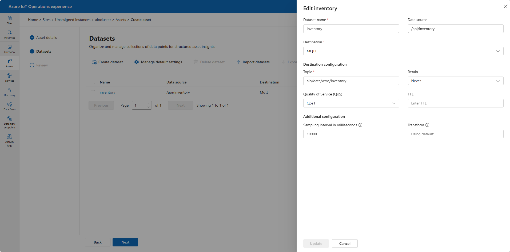  （Sampling interval 必須）
6. **Next**
7. Review で確認後 **Create**
   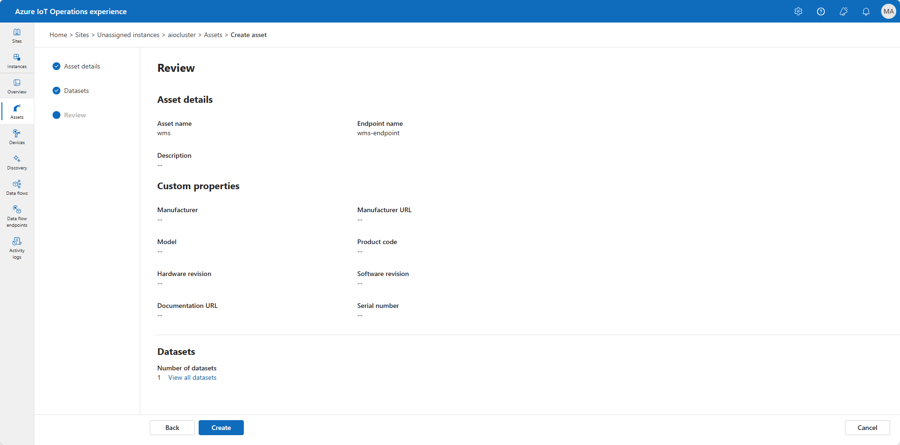

### Step 5.7: データフロー確認

数分待って HTTP Connector が取得を開始:

```bash
kubectl get pods -n azure-iot-operations | grep httpconnector

kubectl logs -n azure-iot-operations $(kubectl get pods -n azure-iot-operations -o name | grep httpconnector) --tail=100

kubectl logs -n azure-iot-operations $(kubectl get pods -n azure-iot-operations -o name | grep httpconnector) -f

kubectl get assets.namespaces.deviceregistry.microsoft.com wms  -n azure-iot-operations -o json
```

**期待結果**: 10秒ごとに在庫データが送られる。

---

## Step 6: Data Flow 2 - HTTP Connector から Fabric (35分)

### Step 6.1: アーキテクチャ - Flow 2

```
┌──────────────┐     ┌──────────────┐     ┌────────────────┐
│  WMS System  │     │   HTTP/REST  │     │ MQTT Broker    │     ┌─────────────────────┐
│   REST API   │────→│   Connector  │────→│ (MQTT topics)  │────→│ Fabric RTI          │
│              │     │  (Built-in)  │     │                │     │ Eventstream (WMS)   │
└──────────────┘     └──────────────┘     └────────────────┘     └─────────────────────┘
```

### Step 6.2: WMS 用の Event Stream を作成

1. [https://fabric.microsoft.com](https://fabric.microsoft.com) にサインイン
2. Workspace を作成/選択
3. **New Item** → **Eventstream**
4. 名前を付ける（例 `aio-wms-eventstream`）
5. 編集画面を開く
6. **Add source** → **Custom endpoint**
   - 名前（例 `mqtt-iot-wms`）
   - Publish

### Step 6.3: Event Stream 接続情報の取得

Details ペイン:
**Details** → **Kafka** → **Entra ID Authentication**

- Bootstrap server
- Topic name

**参考**: [Add a Custom Endpoint to an Eventstream - Microsoft Fabric](https://learn.microsoft.com/en-us/fabric/real-time-intelligence/event-streams/add-source-custom-app?pivots=basic-features#add-custom-endpoint-data-as-a-source)

### Step 6.4: Data Flow Endpoint 作成 - Fabric RTI (WMS)

1. [IoT Operations experience](https://iotoperations.azure.com/) にサインイン
2. インスタンス選択
3. **Data flow endpoints** を開く
4. **Microsoft Fabric Real-Time Intelligence** を作成
5. 設定:

   - **Name**: `fabric-rti-wms-endpoint`
   - **Authentication method**: **User assigned managed identity**
   - **Host**: WMS Event Stream の Bootstrap server
   - **Client ID**: `mi-dataflow-fabric` の Client ID
   - **Tenant ID**: 同じ Tenant ID
6. **Apply** をクリック
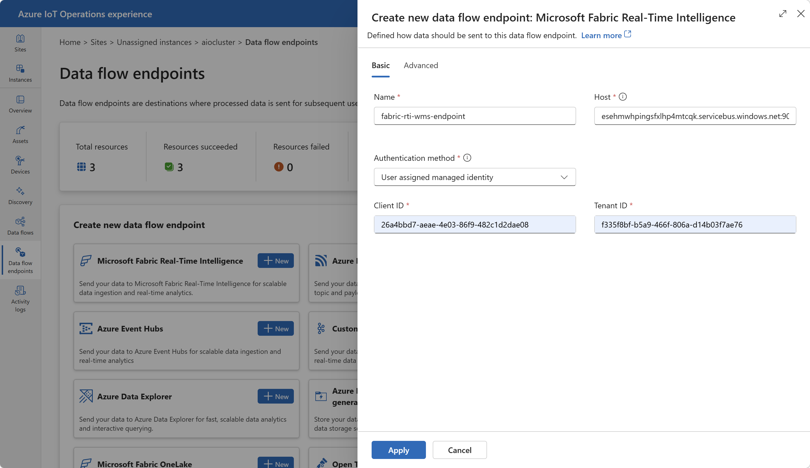
> **注意**: 2つの Data Flow Endpoint は同じ Managed Identity を使用します。

### Step 6.5: HTTP Connector から Fabric への Data Flow

HTTP Connector は `aio/data/wms/inventory` に送信済み。Fabric へ転送する Data Flow を作成します。

1. [IoT Operations Experience](https://iotoperations.azure.com/) にサインイン
2. **Data Flows** へ移動
3. **Create new** をクリック
4. Flow 2 を設定:

   - **Source**: **Asset** → 作成済み Asset（例 **wms**）
   - **Source Details**: **Dataset** `inventory`
   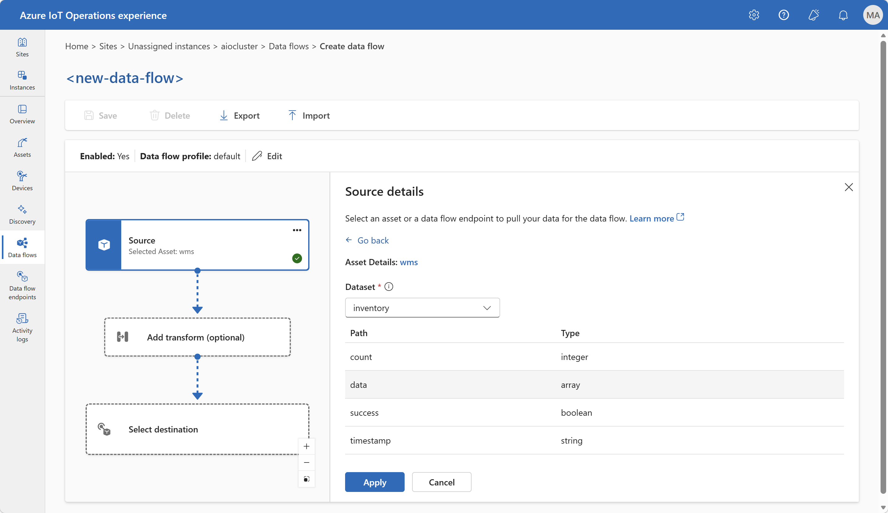
   - **Transform**: None
   - **Destination**: **fabric-rti-wms-endpoint**

   - WMS Event Stream の Topic をコピー
    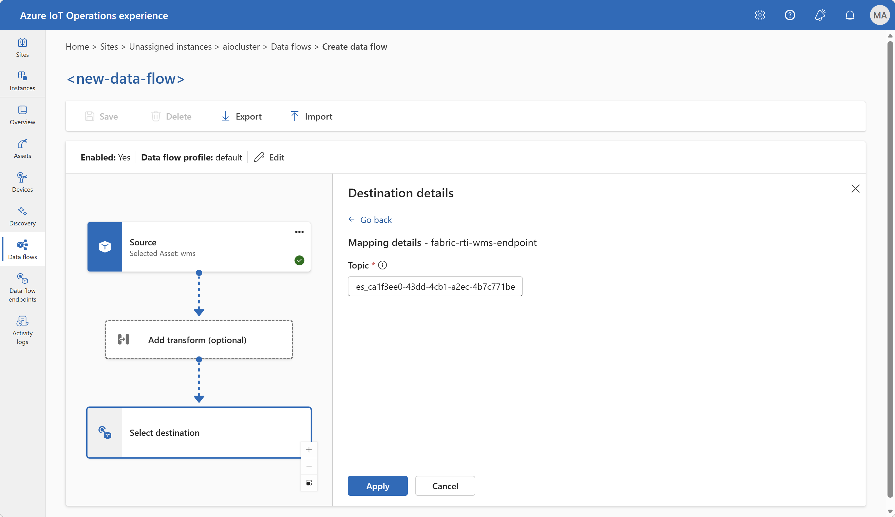
5. **Save** をクリックし、設定後に再度 **Save**

   - **Data flow name**: 例 **df-wms-inventory**
   - **Enable data flow**: **Yes**
   - **Request data persistence**: **Yes**
   - **Data flow profile**: **default**
   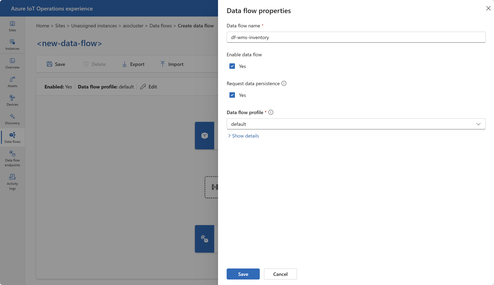

## Step 7: Flow 2 エンドツーエンドテスト (25分)

### Step 7.1: Fabric で WMS データ確認

1. Fabric Real-Time Intelligence に戻る
2. Eventstream を確認:

   - **Data preview** に WMS 在庫データが表示
3. データ構造を確認

**期待結果**: HTTP Connector が 10 秒ごとにデータを取得し、MQTT Broker 経由で Fabric に届く。
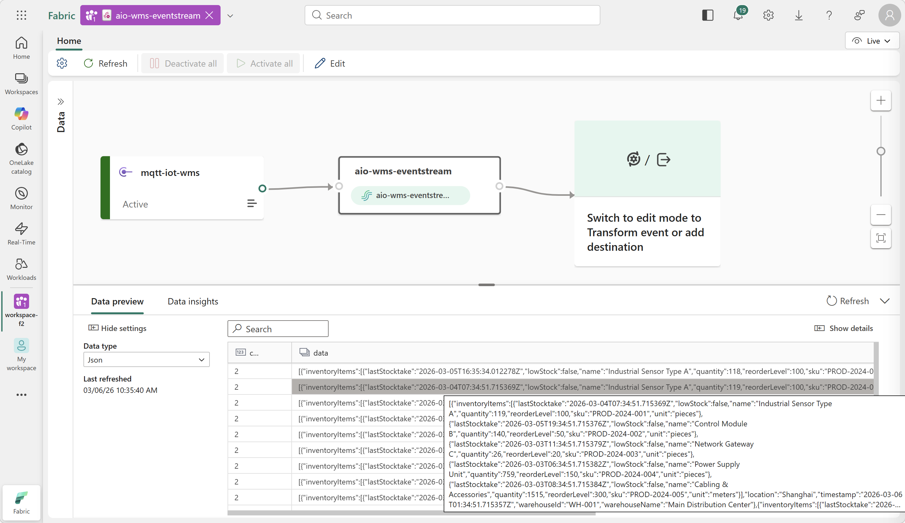
---

## 予定時間 (Part 2)

- MQTT Broker 構成: 30分
- Fabric 設定: 25分
- Data Flow 構成（Flow 1）: 25分
- MQTTX テスト: 25分
- HTTP Connector 設定: 30分
- Data Flow 構成（Flow 2）: 35分
- エンドツーエンドテスト: 25分
- クリーンアップ: 5分

**合計: 約3-3.5時間**

---

## エンドツーエンドの流れ

```
🔵 Flow 1（クライアント - Step 3-4）:
MQTTX Client → MQTT Broker (external) → Data Flow → Fabric RTI

✅ 確認: MQTTX のメッセージが Fabric に表示

🟢 Flow 2（統合 - Step 5-7 - HTTP Connector）:
WMS API → HTTP Connector → MQTT Broker → Data Flow → Fabric RTI

✅ 確認: HTTP Connector のデータが Fabric に表示
```

---

## 主要リンク

- [Azure IoT Operations - HTTP/REST Connector](https://learn.microsoft.com/en-us/azure/iot-operations/discover-manage-assets/howto-use-http-connector)
- [Azure IoT Operations - Data Flows](https://learn.microsoft.com/en-us/azure/iot-operations/connect-to-cloud/overview-dataflow)
- [Microsoft Fabric Real-Time Intelligence](https://learn.microsoft.com/en-us/fabric/real-time-intelligence/overview)
- [MQTTX Documentation](https://docs.mqttx.app/)
- [Kubernetes Deployment Guide](https://kubernetes.io/docs/concepts/workloads/controllers/deployment/)

---

## Step 8: クリーンアップ (5分)

不要になったら以下を実行:

```powershell
# Ubuntu WSL の削除
wsl --unregister Ubuntu
```

WSL を残し、Azure リソースのみ削除する場合:

```bash
# リソースグループ削除
az group delete --name rg-demo-aio --yes

# Arc 接続削除
az connectedk8s delete --name aiocluster --resource-group rg-demo-aio --yes
```

---

**最終更新**: 2026年3月6日
